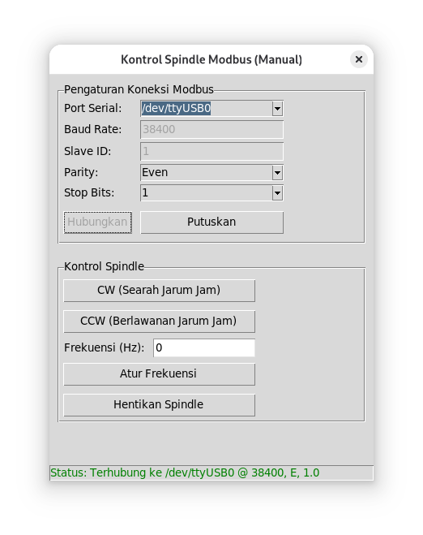
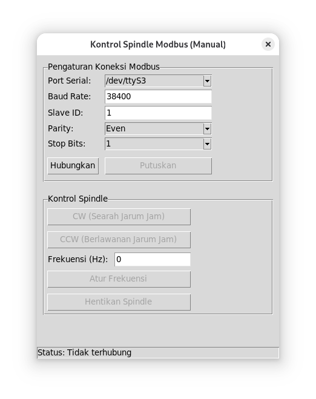

# Kontrol Spindle LEO

Aplikasi desktop sederhana yang dibuat dengan Python dan Tkinter untuk mengontrol spindle motor melalui komunikasi serial Modbus RTU.

## Fitur

-   **Antarmuka Grafis (GUI)**: Mudah digunakan untuk mengoperasikan spindle tanpa perlu menulis perintah di terminal.
-   **Koneksi Fleksibel**: Secara otomatis mendeteksi dan memungkinkan pemilihan port serial yang tersedia di sistem.
-   **Pengaturan Lanjutan**: Pengguna dapat mengonfigurasi parameter koneksi serial, termasuk:
    -   Baud Rate
    -   Parity (Even, Odd, None, etc.)
    -   Stop Bits (1, 1.5, 2)
    -   Slave ID
-   **Kontrol Penuh Spindle**:
    -   Memutar searah jarum jam (CW - Clockwise).
    -   Memutar berlawanan arah jarum jam (CCW - Counter-Clockwise).
    -   Mengatur kecepatan spindle dengan mengatur nilai frekuensi.
    -   Menghentikan putaran spindle secara langsung.
-   **Status Real-time**: Memberikan umpan balik visual mengenai status koneksi (terhubung, terputus, gagal) dan status perintah yang dikirim ke spindle.

## Tampilan Program




## Kebutuhan Sistem

-   Python 3.x
-   `pyserial`: Untuk komunikasi serial.
-   `tkinter`: Untuk antarmuka grafis (biasanya sudah terinstal bersama Python).

## Instalasi

1.  **Clone atau unduh repositori ini.**

2.  **Buat dan aktifkan virtual environment (sangat dianjurkan):**
    ```bash
    # Untuk Linux/macOS
    python3 -m venv venv
    source venv/bin/activate

    # Untuk Windows
    python -m venv venv
    venv\Scripts\activate
    ```

3.  **Instal dependensi yang dibutuhkan dari file `requirements.txt`:**
    ```bash
    pip install pyserial
    ```

## Cara Penggunaan

1.  Pastikan perangkat spindle Anda terhubung ke komputer melalui konverter serial (misalnya, USB to RS485).

2.  Jalankan aplikasi dari terminal:
    ```bash
    python main.py
    ```

3.  **Langkah-langkah di dalam aplikasi:**
    a. Pilih **Port Serial** yang sesuai dengan perangkat Anda dari daftar dropdown.
    b. Atur **Baud Rate**, **Parity**, **Stop Bits**, dan **Slave ID** agar cocok dengan konfigurasi spindle Anda.
    c. Klik tombol **"Hubungkan"**. Label status akan berubah menjadi hijau jika koneksi berhasil.
    d. Setelah terhubung, gunakan tombol kontrol (CW, CCW, Atur Frekuensi, Hentikan) untuk mengoperasikan spindle.
    e. Jika sudah selesai, klik tombol **"Putuskan"** untuk menutup koneksi serial dengan aman.

## Struktur Kode

-   `main.py`: File tunggal yang berisi seluruh kode aplikasi.
    -   **`ManualModbusController`**: Kelas ini menangani logika tingkat rendah untuk komunikasi Modbus RTU. Ia bertanggung jawab untuk membuat frame data (termasuk kalkulasi CRC), mengirimkannya melalui port serial, dan membaca respons.
    -   **`SpindleGUI`**: Kelas ini membangun dan mengelola semua elemen antarmuka pengguna (GUI) menggunakan `tkinter`. Kelas ini juga menangani interaksi pengguna dan memanggil metode dari `ManualModbusController`.

## Pesan Modbus yang Dikirim

|No|nama perintah|contoh perintah|keterangan tambahan|
|---|---|---|---|
|1|spindle berputar ke kanan|0x01, 0x06, 0x6000, 0x0001, 0xZZZZ|0xZZZZ adalah crc-16 |
|2|spindle berputar ke kiri|0x01, 0x06, 0x6000, 0x0002, 0xZZZZ| - |
|3|kirim nilai frekuensi ke vfd|0x01, 0x06, 0x5000, 0xYYYY, 0xZZZZ|0xYYYY adalah nilai frekuensi yang akan dikirkm dalam hex|
|3|hentikan vfd|0x01, 0x06, 0x5000, 0x0000, 0xZZZZ|jika nilai frekuensi 0, spindle berhenti|


